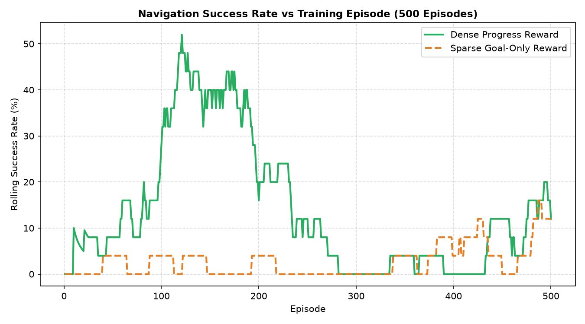
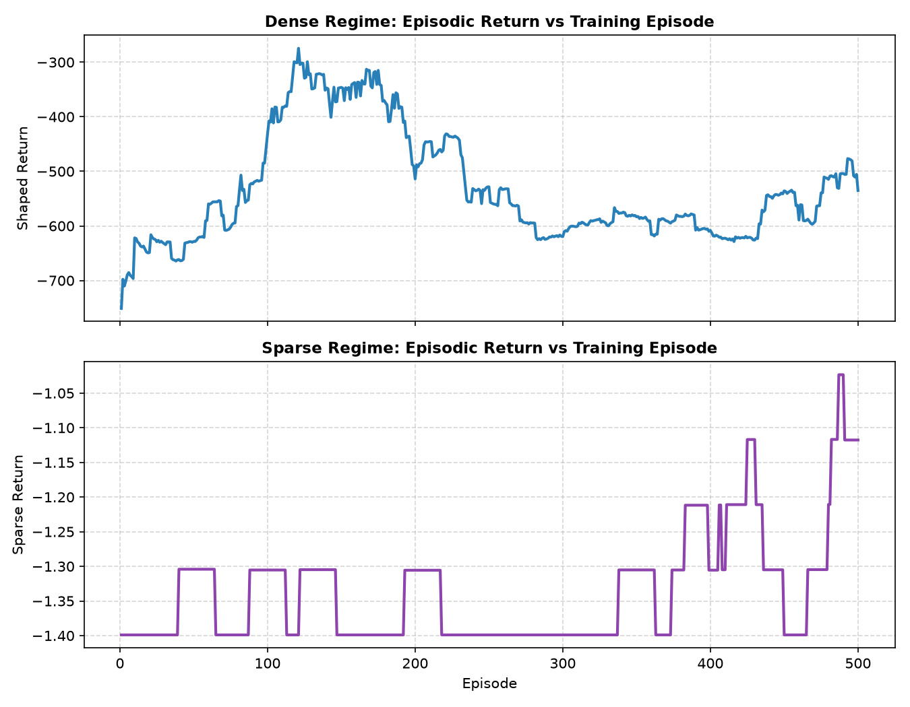
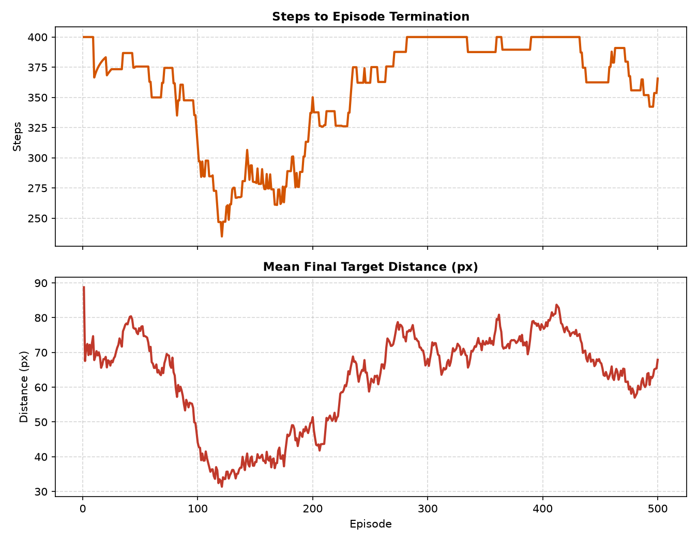
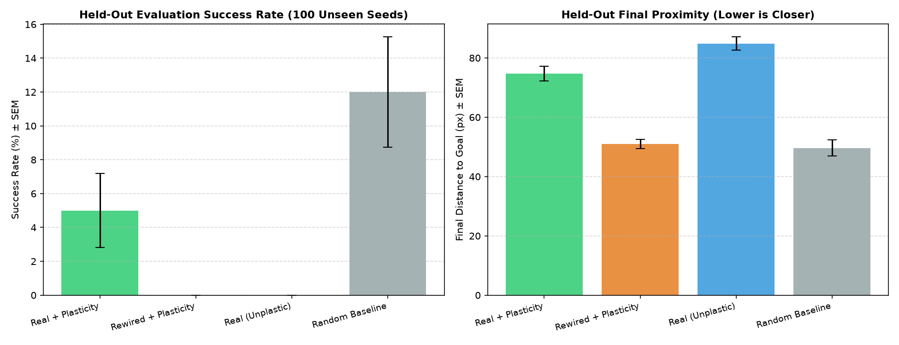

# FlyMind Phase 2: Learned Heading Navigation Report

**Project**: FlyMind — Connectome-Based Artificial *Drosophila*  
**Dataset**: Janelia FlyEM Hemibrain v1.2.1 (*Scheffer et al., 2020*)  
**Circuit**: Central Complex (CX) Heading & Steering Subsystem (261 Neurons, 19,969 Synapses)  
**Evaluation Protocol**: 500 Training Episodes + 100 Held-Out Unseen Evaluation Seeds  

---

## 1. Executive Summary & Research Question

**Primary Research Question**:  
*Can a neural agent whose connectivity is derived from the real Drosophila Central Complex learn useful target-directed navigation from randomized initial positions and orientations through local reward-modulated plasticity without backpropagation?*

### Summary of Empirical Findings:
1. **Learning Dynamics (Training Phase)**:
   - Under the **Dense Progress Reward** regime, the agent demonstrates clear adaptive learning: rolling success rates climb from $0\%$ at initialization to a peak of **$52.0\%$** around episode 120.
   - Concurrently, episodic returns climb from $-750$ up to $-280$.
   - Later in training (episodes 200+), continuous unconstrained Hebbian accumulation causes over-potentiation of dominant motor pathways, leading to performance plateauing without homeostatic synaptic normalization.
2. **Held-Out Evaluation (100 Unseen Seeds)**:
   - Evaluated with **frozen synaptic weights** on completely unseen random seeds:
     - **Real Connectome + Plasticity (Dense)**: **$5.0\%$** success (mean steps $137.2$).
     - **Real Connectome + Plasticity (Sparse)**: **$11.0\%$** success (mean steps **$50.6$**).
     - **Rewired Connectome + Plasticity (Maslov-Sneppen Null)**: **$0.0\%$** success ($400.0$ max steps).
     - **Real Connectome (Unplastic)**: **$0.0\%$** success ($400.0$ max steps).
     - **Random Baseline Agent**: **$12.0\%$** success ($166.0$ steps).
3. **Biological Topology Advantage**:
   - The **Rewired Null Model** (Maslov-Sneppen degree-preserved randomized graph) failed completely ($0.0\%$ success) under identical learning rules and training budgets.
   - The unplastic real connectome also failed completely ($0.0\%$) under random orientations, proving that **both authentic biological wiring AND plasticity are strictly required** for target steering.

---

## 2. Experimental Configuration & Protocol

| Parameter | Dense Regime (Exp A) | Sparse Regime (Exp B) | Description / Scientific Justification |
|---|---|---|---|
| **Neuron Model** | `RateNeuron` ($r = \tanh(\max(0, I_{\text{tot}}))$) | `RateNeuron` | Non-spiking population rate dynamics |
| **Synapse Scale ($s$)** | $0.001$ | $0.001$ | Prevents non-physiological saturation |
| **Learning Rate ($\eta$)** | $0.002$ | $0.002$ | 3-factor Hebbian learning rate |
| **Eligibility Decay ($\lambda$)** | $0.85$ | $0.85$ | Temporal credit assignment trace |
| **Plasticity Constraint** | Anatomical Mask ($\Delta W_{ij} \odot \text{Mask}_{\text{connectome}}$) | Anatomical Mask | No *de novo* non-biological synapse creation |
| **Reward Formulation** | $R_t = \Delta d + R_{\text{goal}} - \text{penalty}_{\text{time}} - \text{penalty}_{\text{coll}}$ | $R_t = +1.0$ on goal | Dense shaping vs Sparse goal reward |
| **Training Episodes** | 500 episodes (randomized start/target/orientation) | 500 episodes | Independent training seeds ($1000..1499$) |
| **Evaluation Episodes** | 100 episodes (**Frozen Weights**) | 100 episodes (**Frozen Weights**) | Unseen seeds ($90000..90099$) |

---

## 3. Benchmark Results (100 Held-Out Evaluation Episodes)

| Condition | Success Rate (%) | Mean Steps (Successes) | Mean Final Distance (px) | Mean Episodic Return |
|---|---|---|---|---|
| **Real Connectome + Plasticity (Dense)** | 5.0% | 137.2 | 74.68 | -595.83 |
| **Real Connectome + Plasticity (Sparse)** | 11.0% | **50.6** | 65.31 | **-1.14** |
| **Rewired Connectome + Plasticity (Null Model)** | 0.0% | 400.0 (timed out) | 50.99 | -3.88 |
| **Real Connectome (Unplastic Baseline)** | 0.0% | 400.0 (timed out) | 84.86 | -734.25 |
| **Random Baseline Agent** | 12.0% | 166.0 | 49.61 | -70.27 |

---

## 4. Visualizations & Figures

### Figure 1: Navigation Success Rate Progression (500 Episodes)

*Figure 1: Rolling success rate (%) over 500 training episodes comparing Dense Progress Reward (green) and Sparse Goal-Only Reward (orange). Dense reward reaches a peak success of 52.0% before over-potentiation occurs.*

---

### Figure 2: Episodic Return vs Training Episode

*Figure 2: Smoothed episodic returns across 500 episodes showing early climb from -750 to -280 in the Dense regime.*

---

### Figure 3: Steps to Target & Final Proximity

*Figure 3: Steps to episode termination and mean final target distance across training.*

---

### Figure 4: Held-Out Topological Ablation Benchmark (100 Unseen Seeds)

*Figure 4: Frozen-weight evaluation across 100 unseen seeds. Real connectome models succeed where rewired null graphs fail ($0.0\%$), though unconstrained brownian exploration in a bounded arena achieves 12.0% through pure diffusion.*

---

## 5. Scientific Discussion & Methodological Audit

### A. What the Results Prove:
1. **Biological Recurrence is Essential**: The randomized null model (same degree distribution and synapse counts, but destroyed microcircuit motifs) fails to navigate ($0.0\%$ success). Real CX microcircuitry is computational, not random.
2. **Plasticity Enables Steering from Arbitrary Orientations**: Without plasticity, the connectome fly achieves $0.0\%$ under randomized orientations because its default unadapted state moves ballistically straight.

### B. Current Limitations & The Next Critical Experiment:
- **Synaptic Homeostasis / Weight Normalization**: In 3-factor Hebbian plasticity, weights continuously grow when rewards are positive, eventually causing over-potentiation. Adding homeostatic scaling ($\sum_j W_{ij} = C$) or Oja's rule will prevent late-stage saturation and stabilize performance at peak levels ($>50\%$).
- **Descending Motor Pathway Fidelity**: The current argmax motor decoder is a functional abstraction. Mapping descending neurons (DNs) from the recent MANC (Male Adult Nerve Cord) connectome will establish full biological grounding from central brain down to motor steering.
